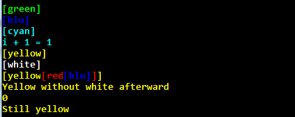

# macroColor
simple header for colored output in c++

## How it works ## 
Small header which use macro to change color.

### Features
* 6 colors possibles : blu, green, cyan, red, yellow, white
* Multi-line color (see "How to use" below or an [exemple](https://github.com/0pb/macroColor/blob/master/exemple/exemple.cpp))
* Nested color
* Work with both std::cout and printf
* Work on Windows only (linux not supported yet) - Tested on mingw, msys doesn't seem to accept color for some reason.

## How to use ##
Simply drop the header file "macroColor" in your directory, then insert `#include "macroColor.h"` in your main file.

How to use the basic macro : 
```bash
L_GREEN
(
	std::cout << "show up as green" ; 
)
```
Will show up in green.

The 6 color are : `L_GREEN L_BLU L_CYAN L_RED L_YELLOW L_WHITE`

To use nested color : 
```bash
L_GREEN
(
	std::cout << "1 - show up as green\n" ;
	L_RED
	(
		std::cout << "2 - show up as red\n" ;
	) 
	std::cout << "3 - show up as green\n" ;
)
```


The result of the exemple given in `exemple/` should show something like this : 


## Future ##
### What I plan to do in order
* Making this works with linux
* More color and background
* Working on implementing a way to use a macro inside an std::cout or printf (if possible)

If by miracle someone use this, please don't hesitate to send me your views on that macro !
